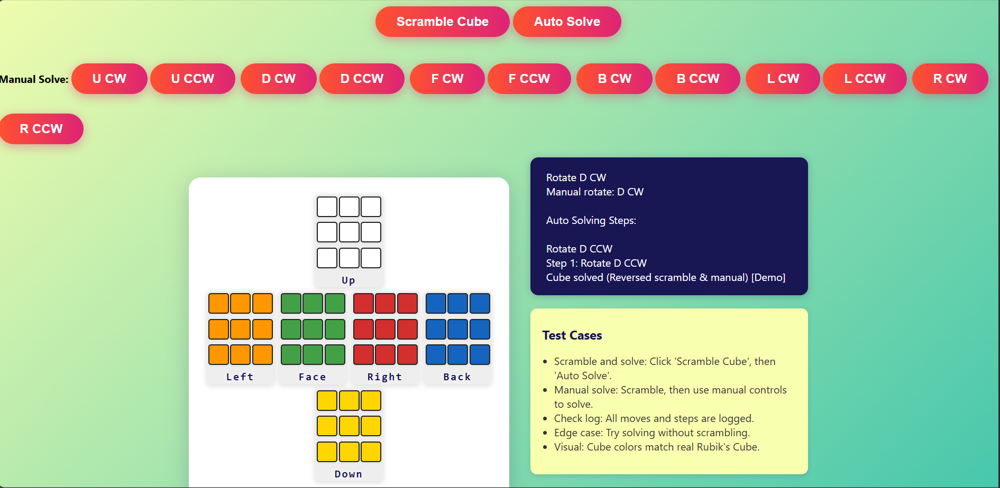

# 🧩 Rubik's Cube Solver


A **visually interactive Rubik's Cube solver** built in pure HTML, CSS, and JavaScript.  
Scramble, manually solve, or watch the cube auto-solve step-by-step — all in your browser!

---

## 🚀 Features

- **Beautiful 2D Cube Visualization**  
  Real Rubik's Cube colors, 3D-like net layout, and SVG rendering.

- **Manual Solve Controls**  
  Rotate any face (CW/CCW) with intuitive buttons.

- **Auto-Solve Algorithm**  
  Reverses all moves (scramble + manual) and guides you step-by-step.

- **Responsive UI**  
  Works on desktop and mobile, with a modern, gradient background.

- **Move Log & Test Cases**  
  Every move is logged for easy review. Built-in test cases for quick validation.

---

## 🖥️ Demo



---

## 📦 Installation

1. **Clone this repository:**
   ```sh
   git clone https://github.com/yourusername/rubiks-cube-solver.git
   cd rubiks-cube-solver
   ```

2. **Open `solver.html` in your browser.**  
   No build steps, no dependencies — just pure HTML/JS!

---

## ✨ Usage

- **Scramble Cube:**  
  Click the `Scramble Cube` button to randomize the cube.

- **Manual Solve:**  
  Use the face rotation buttons to solve the cube step-by-step.

- **Auto Solve:**  
  Stuck? Click `Auto Solve` to watch the cube solve itself from your current state.  
  Manual controls fade out and reactivate when solving is complete.

- **Move Log:**  
  See every move and step in the log panel.

---

## 🧑‍💻 Code Highlights

- **Cube Representation:**  
  Object-oriented JS class for cube state and moves.

- **Visualization:**  
  Both HTML/CSS and SVG rendering supported.

- **Algorithm:**  
  Simple reversal of all moves (scramble + manual) for demonstration purposes.

---

## 📝 Test Cases

- Scramble and auto-solve.
- Manual solve after scrambling.
- Log tracks all moves.
- Edge case: Solve without scrambling.
- Visual: Cube colors match a real Rubik's Cube.

---

## 📚 Learn More

- [Rubik's Cube (Wikipedia)](https://en.wikipedia.org/wiki/Rubik%27s_Cube)

---

## 💡 Contributing

Pull requests and suggestions welcome!  
Feel free to fork and enhance the UI, add new algorithms, or improve the visualization.

---

## 🏷️ License

MIT License

---
